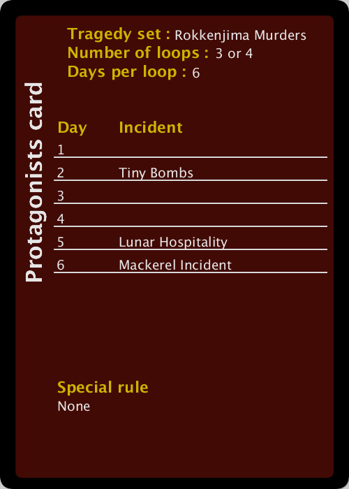
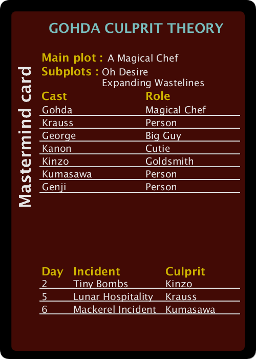

# Hello.

This is my processing script to generate tragedy looper custom script cards that look reminiscent of the official ones.

Here are some examples. Wow!

Here's a mastermind card from the same source. Wowie!

If you want to use this for yourself, get the processing programming language, and edit the first few lines of loopcard.pde so that they conform to the script you've made. You can also change how the background looks to make it look like one of the expansions. After you run the script, you can find the output in the printable.pdf file that was generated.

If you're looking for custom scripts to feed into this generator, you can get them from my curated, playtested custom script repository [here](https://github.com/Redless/script-collection) (quality guaranteed!) or from the scripts that I'm currently working on [here](https://github.com/Redless/looper-workbench) (quality not guaranteed).
