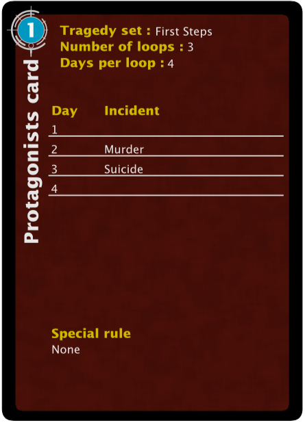
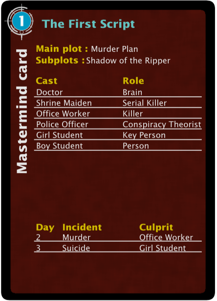

# Hello.

This is my processing script to generate tragedy looper custom script cards that look reminiscent of the official ones.

Here are some examples.

Here's a mastermind card from the same source.

If you want to use this for yourself, get the processing programming language, and edit the files script1.txt, script2.txt, script3.txt, and script4.txt to contain the scripts you want. You can edit them with a text editor like notepad or vim. The available themes are basic tragedy, midnight circle, and cosmic evil.

If you're looking for custom scripts to feed into this generator, you can get them from my curated, playtested custom script repository [here](https://github.com/Redless/script-collection) (quality guaranteed!) or from the scripts that I'm currently working on [here](https://github.com/Redless/looper-workbench) (quality not guaranteed).

Coming soon, I've made another program that makes mastermind handbooks that look like the original. I need to iron out a few bugs with the page orientation and front/back covers, and then that should be on its way, too.

If you have any questions or concerns about using this, message me on boardgamegeek.
